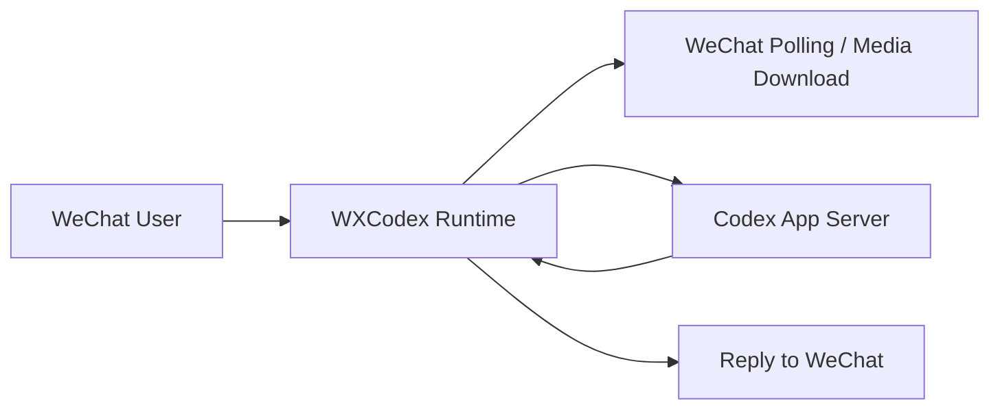

# WXCodex

<p align="center">
  <strong>把 Codex 接进微信，让代码协作从终端延伸到聊天窗口。</strong>
</p>

<p align="center">
  <a href="https://github.com/MoLeft/wxcodex/blob/main/LICENSE"></a>
  
  
  
</p>

WXCodex 是一个本地运行的 TypeScript CLI/TUI 项目，用来把微信消息链路与 Codex 连接起来。

它基于 `@tencent-weixin/openclaw-weixin` 提供的接口能力，可以直接配合微信官方的 OpenClaw 插件体系使用，在微信侧完成消息接入与账号联通。

你可以在本机启动一个终端界面，扫码登录微信机器人账号，接收微信消息，然后把消息转发给 Codex 处理，再将结果回发到微信会话里。它适合做个人助理、代码问答、远程控制式研发辅助，或者作为更复杂微信 Agent 系统的基础层。

## 特性

- 微信二维码登录，自动轮询登录状态
- 本地 TUI 运行界面，直观看到微信、Codex、队列和事件状态
- 共享 Codex 会话线程，适合连续多轮对话
- 支持微信文本消息收发，并带有 typing 状态同步
- 支持图片、文件消息落盘后再结合文本补充进行处理
- 本地数据目录持久化，保存登录态、上下文和运行状态

## 工作方式



WXCodex 主要由三部分组成：

- `src/wechat/*`：微信登录、轮询、消息发送、文件下载
- `src/codex/*`：Codex CLI / app-server 连接桥接
- `src/runtime/*` + `src/tui/*`：运行时编排与终端 UI

## 快速开始

### 1. 准备环境

- Node.js 20 或更高版本
- 已可用的 `codex` CLI
- 可接入的微信机器人能力接口

### 2. 安装

全局安装：

```bash
npm install -g @moleft/wxcodex
```

如果你当前是在仓库源码下体验，也可以先用本地方式安装：

```bash
npm install
npm install -g .
```

### 3. 启动

全局安装后：

```bash
wxcodex
```

从源码目录运行：

```bash
npm run dev
```

或者先构建再运行：

```bash
npm run build
npm start
```

## 使用说明

启动后，程序会进入本地终端界面。完成微信登录后，运行时会开始轮询消息，并将用户消息交给 Codex 处理。

常见使用流程：

1. 启动 `wxcodex`
2. 扫码登录微信
3. 确认 Codex CLI 可用
4. 在微信聊天窗口发送问题
5. 等待 Codex 回复自动回传到微信

## 环境变量

| 变量名 | 说明 |
| --- | --- |
| `WXCODEX_CODEX_BIN` | Codex 可执行文件路径，默认 `codex` |
| `WXCODEX_DATA_DIR` | 本地数据目录，默认 `~/.wxcodex` |
| `WXCODEX_MODEL` | 指定模型 |
| `WXCODEX_REASONING_EFFORT` | 推理强度 |
| `WXCODEX_POLL_TIMEOUT_MS` | 微信消息轮询超时 |
| `WXCODEX_TYPING_INTERVAL_MS` | typing 心跳间隔 |
| `WXCODEX_SYSTEM_PROMPT` | 自定义系统提示词 |
| `WXCODEX_LOG_LEVEL` | 日志级别 |

## 项目结构

```text
.
├─ src/
│  ├─ codex/
│  ├─ runtime/
│  ├─ store/
│  ├─ tui/
│  └─ wechat/
├─ mcp-wechat-server/
├─ happy/
└─ dist/
```

## 开发命令

```bash
npm run dev
npm run build
npm run test
```

## 路线图

- 完善更多微信消息类型支持
- 增强多会话与多用户隔离能力
- 提供更稳定的部署与日志方案
- 补充发布流程与安装分发体验

## 参考项目

本项目的设计与实现过程中，参考了以下项目与资料：

- [`@tencent-weixin/openclaw-weixin`](https://www.npmjs.com/package/@tencent-weixin/openclaw-weixin)
- [`mcp-wechat-server`](https://github.com/Howardzhangdqs/mcp-wechat-server)
- [`happy`](https://github.com/slopus/happy)

## License

本项目基于 [MIT](./LICENSE) 协议开源。
